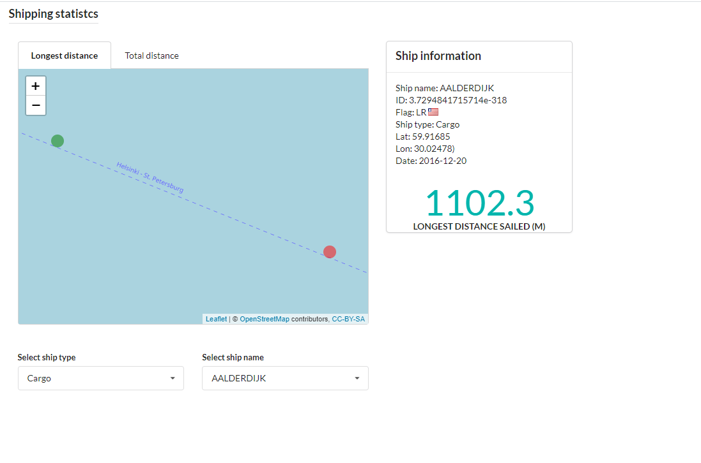

# Overview

The application allows the user to explore AIS information of ships in Europe. The app shows the longest distance traveled by a ship between observations and the total distance sailed per day.

Live version of the app [here](https://jaimeleal.shinyapps.io/shipping/)

## How to use the application

To use the application download the Marine data from [here](https://drive.google.com/file/d/1IeaDpJNqfgUZzGdQmR6cz2H3EQ3_QfCV/view) and place it in the main folder.

